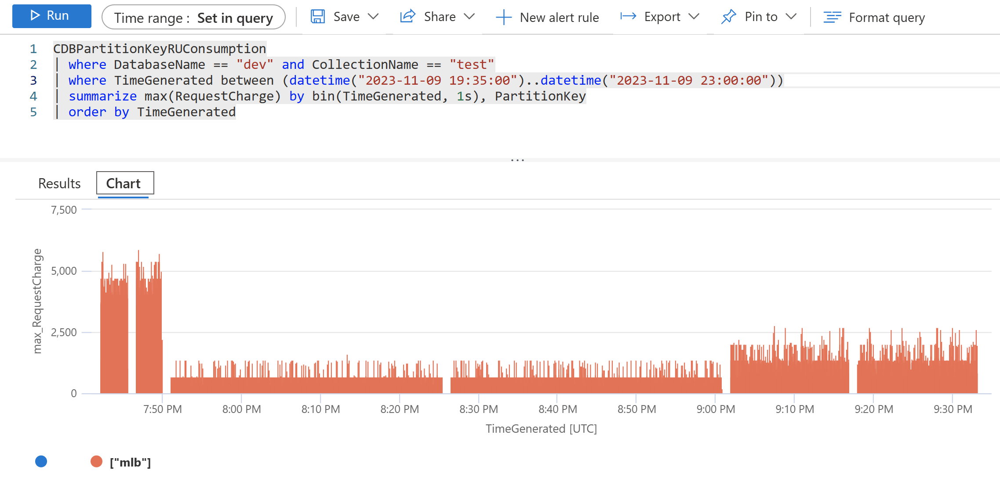

# azure-cosmos-db-throughput : java

Code samples related to Cosmos DB Throughput, Throughput Control, and Priority-based execution.

Implementation highlights:
- The implementation uses the Gradle build tool, version 7.4.2.
- **com.azure:azure-cosmos:4.48.2** is the version of the Cosmos DB Java SDK that is used.
- openjdk 17.0.7 2023-04-18 LTS was used to produce these test results.

## Executing the test program

```
> cd <this directory>
> mkdir tmp
> gradle build

> .\throughput_tests.ps1
```

The program reads a dataset of approx 60K Baseball Players which is in this repo
and then bulk loads these into the same Cosmos DB database and container.
Database 'dev' and container 'test' was used with this implementation.
The partition key is /pk, and the container uses autoscale 4000 Request Units.
All documents are written to the same logical partition - mlb.

The throughput_tests.ps1 script executes six bulk loads of this same data,
but with the following different throughput control configurations (see the build.gradle file).
The script sleeps for 1-minute between tests.

- throughput_test_low_priority - PriorityLevel.LOW
- throughput_test_high_priority - PriorityLevel.HIGH
- throughput_test_ru_limited_local - Local Throughput Control with 400 RUs, batch size 50
- throughput_test_ru_limited_global - Global Throughput Control with 400 RUs, batch size 50
- throughput_test_pct_limited_local - Local Throughput Control with 25% of RUs, batch size 50
- throughput_test_pct_limited_global - Global Throughput Control with 25% of RUs, batch size 50

The program logging includes generated KQL snippets for the timeframe of each test, such as:
```
09:03:01.708 [main] WARN  App - kql: | where TimeGenerated between (datetime("2023-11-09 13:59:43")..datetime("2023-11-09 14:03:01"))
```

### Azure Monitor Report

An Azure Monitor KQL statement like the following can be executed to report on RU consumption thoughout the six tests:

```
CDBPartitionKeyRUConsumption
| where DatabaseName == "dev" and CollectionName == "test"
| where TimeGenerated between (datetime("2023-11-09 13:35:00")..datetime("2023-11-09 14:10:00"))
| summarize max(RequestCharge) by bin(TimeGenerated, 1s), PartitionKey
| order by TimeGenerated
```

The report can be viewed as the following graph:

<p align="center">
  
</p>

Note that the first two scenarios in the above graph, LOW and HIGH 
Priority-Based-Execution, show full RU consumption rather than throttled
RU consumption.  This is because this feature is in private preview,
and my Cosmos DB account was not enabled to use it at the time of the test.

---

## Links

- https://devblogs.microsoft.com/cosmosdb/latest-nosql-java-ecosystem-updates-2023-q1-q2/
  - https://learn.microsoft.com/en-us/azure/cosmos-db/nosql/quickstart-java?tabs=passwordlesssync%2Csign-in-azure-cli%2Csync-throughput#use-throughput-control
  - https://devblogs.microsoft.com/cosmosdb/introducing-priority-based-execution-in-azure-cosmos-db-preview/
  - https://github.com/Azure-Samples/azure-cosmos-java-sql-api-samples/blob/da39bf4e57c6d814c478d10eed5c2905a764d667/src/main/java/com/azure/cosmos/examples/throughputcontrol/async/ThroughputControlQuickstartAsync.java#L233

- https://devblogs.microsoft.com/cosmosdb/azure-cosmos-db-java-ecosystem/

### Priority-based execution

- https://devblogs.microsoft.com/cosmosdb/introducing-priority-based-execution-in-azure-cosmos-db-preview/

---

## Logging

- https://learn.microsoft.com/en-us/azure/cosmos-db/monitor-resource-logs?tabs=azure-portal
- https://learn.microsoft.com/en-us/azure/cosmos-db/nosql/diagnostic-queries?tabs=resource-specific
- https://learn.microsoft.com/en-us/azure/data-explorer/kusto/query/kql-quick-reference
- https://learn.microsoft.com/en-us/azure/cosmos-db/insights-overview

### Normalized RU Consumption Metric

- https://learn.microsoft.com/en-us/azure/cosmos-db/monitor-normalized-request-units

> The Normalized RU Consumption metric is a metric between 0% to 100% that is used to help
> measure the utilization of provisioned throughput on a database or container. 
> The metric is emitted at 1 minute intervals and is defined as the maximum RU/s utilization 
> across all partition key ranges in the time interval.
